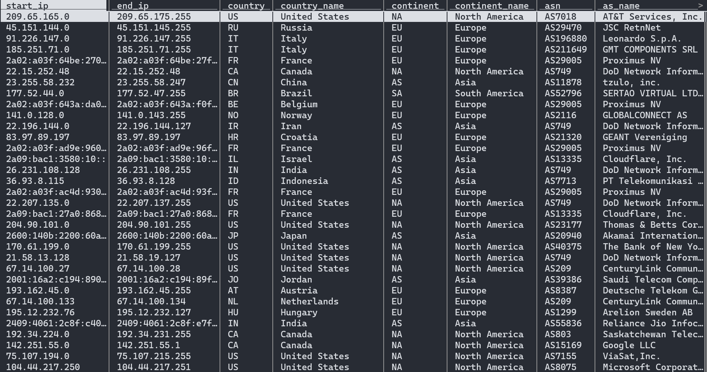

Country ASN →  IP Range / Prefix Generator
---

## Generating the list of IP ranges or prefixes based on one or more countries or ASNs using IPinfo.io

<video src="assets/extracting_prefixes.mp4" controls title="Country IP Range / Prefix Generator"></video>

**Powered by: [IPinfo CLI](https://github.com/ipinfo/cli) and [IPinfo Free IP to Country ASN Database](https://ipinfo.io/products/free-ip-database)**

## 1. Instructions

### 1.1. Setting up the [IPinfo CLI](https://github.com/ipinfo/cli)

Install the [IPinfo CLI](https://github.com/ipinfo/cli). Follow the installation instructions from the GitHub repo: https://github.com/ipinfo/cli

Set it up with your [IPinfo Access Token](https://ipinfo.io/account/token). You can get that from your [IPinfo account dashboard](https://ipinfo.io/account/token) after you have [signed up](https://ipinfo.io/signup) for a free account. To set up the CLI with the IPinfo access token, run the following command:

```
ipinfo init
```

Then paste in your IPinfo access token.

### 1.2. Download the [IPinfo IP to Country ASN database](https://ipinfo.io/products/free-ip-database) into your current directory

Download the [IPinfo IP to Country ASN database](https://ipinfo.io/products/free-ip-database) into the current directory. To download the database, run the following command:

```
ipinfo download country-asn -f csv > ./country_asn.csv
```


🔗 [IPinfo IP to Country ASN Database Schema](https://ipinfo.io/developers/ip-to-country-asn-database)


### 1.3. Create the target list of countries and ASNs

Now that you have downloaded the IP to Country ASN database, extract the target IP address information from the IP database. You can put the target country and ASN in the `target.txt` file in the same directory.

You can add a combination of AS and Country data there. However, make sure:

- The country names are in the two-letter country code format, written in block letters. This format is called [ISO 3166-1 alpha-2](https://en.wikipedia.org/wiki/ISO_3166-1_alpha-2). For example, `US`, `GB`, `IN`, etc.
- The ASN needs to be preceded by the keyword `AS`. For example, `AS213`, `AS12341`, etc.
- Put each target country/ASN on their own separate line. Avoid adding trailing or leading spaces or newlines.

> target.txt

```plaintext
PH
RU
AS1222
AS1827
```

### 1.4. Extract the target country or ASN from the IP database

Now as you have the prepared the `target.txt` file it is time to extract the relevant IP metadata information from the IP to Country ASN database.

We need to prepare the `target.txt` file for the `grep` command by removing any accidental trailling spaces and then adding leading and trailling commas (`,`) to each line. The commas seperate each values and assists with grep opeation as our IP database is in `csv` format.

**Using Bash**

```bash
sed 's/[[:space:]]*$//; s/^/,/; s/$/,/' target.txt > format_target.txt
```

**Using PowerShell**

```powershell
(Get-Content -Path 'target.txt' | ForEach-Object { $_ -replace '\s*$', '' -replace '^', ',' -replace '$', ',' }) -join "`n" | Set-Content -NoNewline -Path 'format_target.txt'
```

From this a `format_target.txt` file be generated.

> `format_target.txt`

```plaintext
,PH,
,RU,
,AS1222,
,AS1827,
```

Using the `format_target.txt`, we will extract the header row of the CSV file and any rows that matches any country or asn in `target.txt` file.

**Using Bash**

```bash
(head -1 country_asn.csv;grep -f format_target.txt country_asn.csv) > filtered_country_asn.csv
```

**Using Powershell**

```powershell
Get-Content country_asn.csv | Select-Object -First 1 | Out-File -FilePath filtered_country_asn.csv -Encoding utf8
Get-Content country_asn.csv | Select-String -Pattern (Get-Content format_target.txt) | Out-File -NoNewline -FilePath filtered_country_asn.csv -Append -Encoding utf8
```

### 1.5. Convert the "IP range" columns to their "CIDR" format

The IPinfo IP to Country to ASN database contains IP ranges from `start_ip` to `end_ip` in CIDR format.

> filtered_country_asn.csv

| start_ip         | end_ip                                  | country | country_name | continent | continent_name | asn | as_name | as_domain |
|------------------|-----------------------------------------|---------|--------------|-----------|----------------|-----|---------|-----------|
| 2001:df4:6301::  | 2001:df4:6301:ffff:ffff:ffff:ffff:ffff  | PH      | Philippines  | AS        | Asia           |     |         |           |
| 2001:df5:da00::  | 2001:df5:da00:ffff:ffff:ffff:ffff:ffff  | PH      | Philippines  | AS        | Asia           |     |         |           |
| 2407:b140:137a:: | 2407:b140:ffff:ffff:ffff:ffff:ffff:ffff | PH      | Philippines  | AS        | Asia           |     |         |           |
| 2a0a:6040:d212:: | 2a0a:6040:d213:ffff:ffff:ffff:ffff:ffff | PH      | Philippines  | AS        | Asia           |     |         |           |
| 202.84.112.0     | 202.84.112.255                          | PH      | Philippines  | AS        | Asia           |     |         |           |
| 2405:7540::      | 2405:7540:ffff:ffff:ffff:ffff:ffff:ffff | PH      | Philippines  | AS        | Asia           |     |         |           |
| 202.4.12.0       | 202.4.15.255                            | PH      | Philippines  | AS        | Asia           |     |         |           |
| 207.209.106.0    | 207.209.106.255                         | PH      | Philippines  | AS        | Asia           |     |         |           |
| 202.162.161.0    | 202.162.162.255                         | PH      | Philippines  | AS        | Asia           |     |         |           |


After you created the `filtered_country_asn.csv` file, you will need to convert the `start_ip` and `end_ip` column to their CIDR equivalent run the following command:

```
ipinfo range2cidr ./filtered_country_asn.csv > ./filtered_country_asn_cidr.csv
```

> filtered_country_asn_cidr.csv

| cidr                | country | country_name | continent | continent_name | asn | as_name | as_domain |
|---------------------|---------|--------------|-----------|----------------|-----|---------|-----------|
| 2001:df4:6301::/48  | PH      | Philippines  | AS        | Asia           |     |         |           |
| 2001:df5:da00::/48  | PH      | Philippines  | AS        | Asia           |     |         |           |
| 2407:b140:137a::/47 | PH      | Philippines  | AS        | Asia           |     |         |           |
| 2407:b140:137c::/46 | PH      | Philippines  | AS        | Asia           |     |         |           |
| 2407:b140:1380::/41 | PH      | Philippines  | AS        | Asia           |     |         |           |
| 2407:b140:1400::/38 | PH      | Philippines  | AS        | Asia           |     |         |           |
| 2407:b140:1800::/37 | PH      | Philippines  | AS        | Asia           |     |         |           |
| 2407:b140:2000::/35 | PH      | Philippines  | AS        | Asia           |     |         |           |
| 2407:b140:4000::/34 | PH      | Philippines  | AS        | Asia           |     |         |           |


IP Range columns `start_ip` and `end_ip` converted to their CIDR equivalent in the `cidr` column.

### 1.6. Extract the ranges/prefixes

After you have:

- Downloaded the IPinfo IP to Country ASN database
- Filtered the IPinfo IP database according to your target ASN and Country
- Converted the IP range columns (`start_ip`,`end_ip`) to the CIDR

You are ready to extract the IP ranges or prefixes. The ranges will be stored in `ip_ranges.txt` file. Run the following command:

**Using Bash**

```bash
awk -F ',' 'NR > 1 {print $1}' filtered_country_asn_cidr.csv > ip_ranges.txt
```


**Using Powershell**

```powershell
Get-Content "filtered_country_asn_cidr.csv" | Select-Object -Skip 1 | ForEach-Object { ($_ -split ',')[0] } | Out-File -FilePath "ip_ranges.txt"
```

> ip_ranges.txt

```
2001:df5:da00::/48
2407:b140:137a::/47
2407:b140:137c::/46
2407:b140:1380::/41
2407:b140:1400::/38
2407:b140:1800::/37
2407:b140:2000::/35
2407:b140:4000::/34
2407:b140:8000::/33
```


Now, you have your filtered ranges or prefixes.

## Summary

### Overview

- Install the [IPinfo CLI](https://github.com/ipinfo/cli)
- Download the IPinfo IP database using the CLI
- Create a target ASN/Country file called `target.txt`
- Extract the IP metadata information of the target ASN/Country
- Convert the IP range to their CIDR format
- Extract the CIDR values and store them in `ip_ranges.txt` file

### `bash`


```bash
ipinfo download country-asn -f csv > ./country_asn.csv
sed 's/[[:space:]]*$//; s/^/,/; s/$/,/' target.txt > format_target.txt
(head -1 country_asn.csv;grep -f format_target.txt country_asn.csv) > filtered_country_asn.csv
ipinfo range2cidr ./filtered_country_asn.csv > ./filtered_country_asn_cidr.csv
awk -F ',' 'NR > 1 {print $1}' filtered_country_asn_cidr.csv > ip_ranges.txt
```

**Checkout the [`extract_ranges.sh`](./extract_ranges.sh) script.**

### `Powershell`

The following commands are ran for the operation: 

```powershell
ipinfo download country-asn -f csv > ./country_asn.csv
(Get-Content -Path 'target.txt' | ForEach-Object { $_ -replace '\s*$', '' -replace '^', ',' -replace '$', ',' }) -join "`n" | Set-Content -NoNewline -Path 'format_target.txt'
Get-Content country_asn.csv | Select-Object -First 1 | Out-File -FilePath filtered_country_asn.csv -Encoding utf8
Get-Content country_asn.csv | Select-String -Pattern (Get-Content format_target.txt) | Out-File -NoNewline -FilePath filtered_country_asn.csv -Append -Encoding utf8
ipinfo range2cidr ./filtered_country_asn.csv > ./filtered_country_asn_cidr.csv
Get-Content "filtered_country_asn_cidr.csv" | Select-Object -Skip 1 | ForEach-Object { ($_ -split ',')[0] } | Out-File -FilePath "ip_ranges.txt"
```

**Checkout the [`extract_ranges.ps1`](./extract_ranges.ps1) script.**

### Optional: Updating the IP database daily

As the database is updated daily, you might want to set up a cronjob or scheduler to automate the downloading and range extraction process.

## Acknowledgement

This tool uses the free [IPinfo IP to Country & ASN database](https://ipinfo.io/products/free-ip-database) from [ IPinfo](https://ipinfo.io).